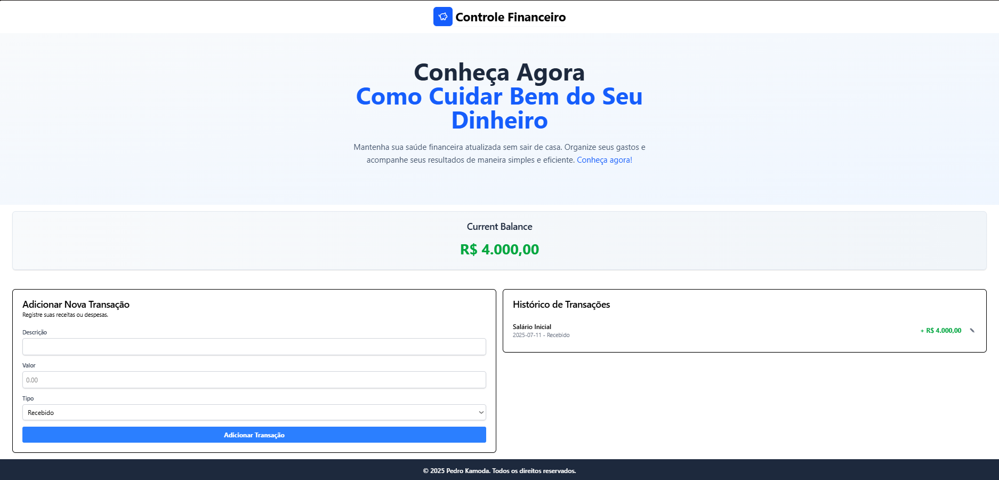

# 📝 Teste de lógica econômica com React!! 

Uma landing page simples, com componentes e funções React que calculam gastos e arrecadações monetárias para um controle financeiro!

## 🚀 Tecnologias utilizadas

## ✨ Funcionalidades

- ✅ Adicionar novos gastos
- ✏️ Editar transações
- ❌ Excluir transações
- ✔️ Salvo no LocalStorage do usuario!
